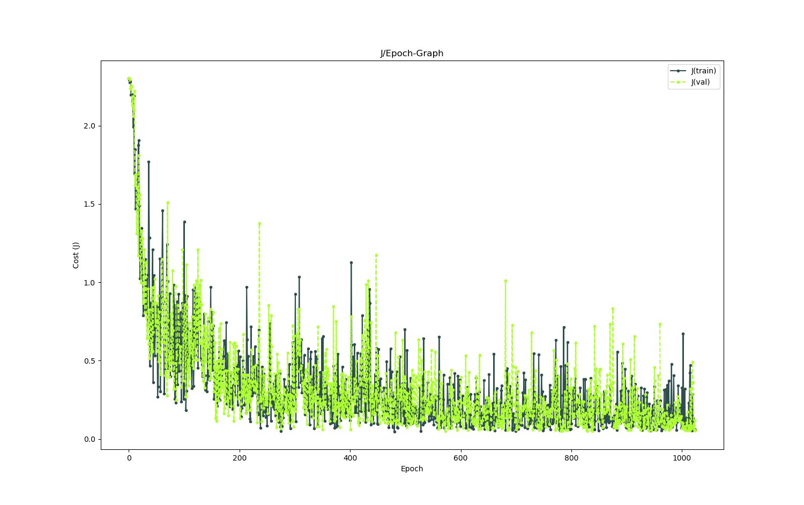
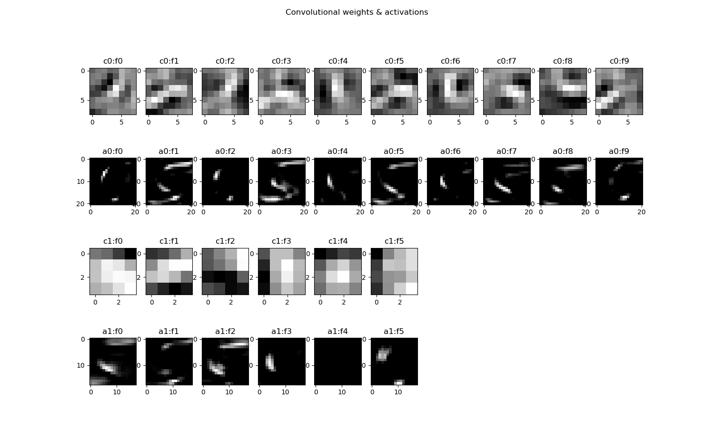

# ConvNet - MNIST Dataset
_Simple ConvNet classifying MNIST data_

---

## About

This is supposed to be a little test project. I want to play around with convolutional layers, pooling layers, normalization strategies (dropout, batch normalization), training algorithms (Vanilla SGD, SGD w. Momentum, etc.) and much more.

## To-Do

* [x] Dataset preparation
* [x] Simple weight initialization
* [x] Advanced weigth initialization (Xavier initialization, etc.)
* [x] Convolution-Function
* [ ] Pooling Layers (Max-Pooling, Average-Pooling, etc.)
* [ ] Dropout
* [ ] Batch Normalization
* [x] Activation-Function (ReLU)
* [x] Loss-Function (Cross Entropy)
* [x] Gradient-Computation Function
* [x] Stochastic Mini Batch Gradient Descent
* [x] Advanced SGD (Momentum, RMSprop, Adam, etc.)
* [x] J/epoch-Graph
* [x] Graphical representation of convolutional Layers
* [x] Prediction-Function
* [x] Model evaluation (Accuracy)
* _... probably more to come ..._

## Results

Best accuracy so far: **93.14%**

_J/Epoch-Graph over 1024 iterations ..._

_Convolutional weights & activations (examples: 8, 5)_

---

... MattMoony (August, 2019)